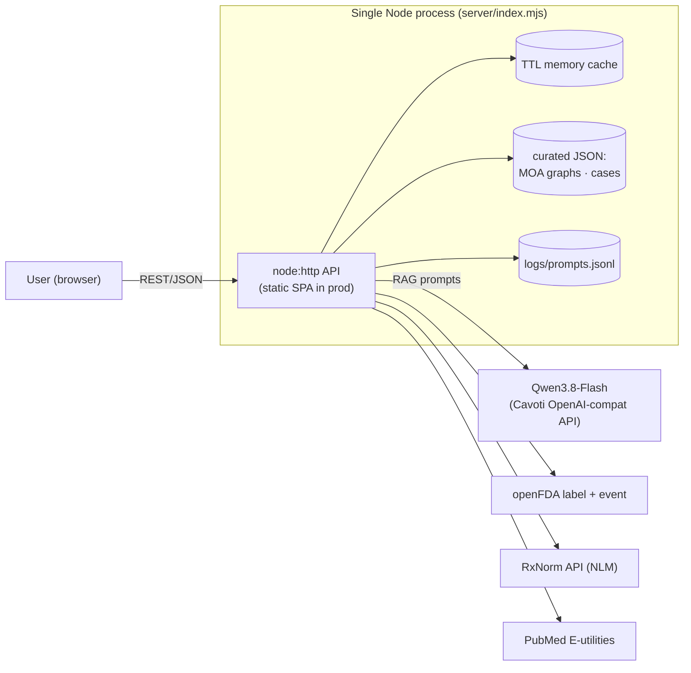
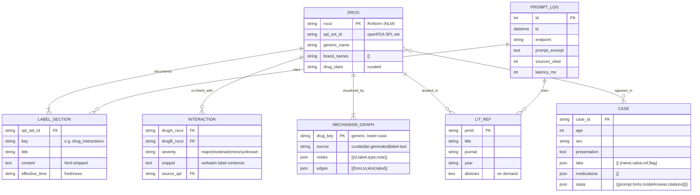

# PharmaLab — Data Model & Architecture

## System architecture (as-built)

Differences from PRD target architecture: direct upstream queries behind an in-memory TTL
cache instead of Elasticsearch/Redis/Postgres (sufficient for a local educational instance);
DrugBank is optional/absent (openFDA + RxNorm fallback path is what ships).

## ER diagram

## Freshness & compliance notes
* openFDA labels weekly · FAERS quarterly (≈3-month lag, no causality) · RxNorm monthly · PubMed live.
* All AI outputs forced to cite SPL/PMID/RxNorm ids or declare "no data".
* No PHI path exists: cases are static fiction, uploads/logs stay local.
